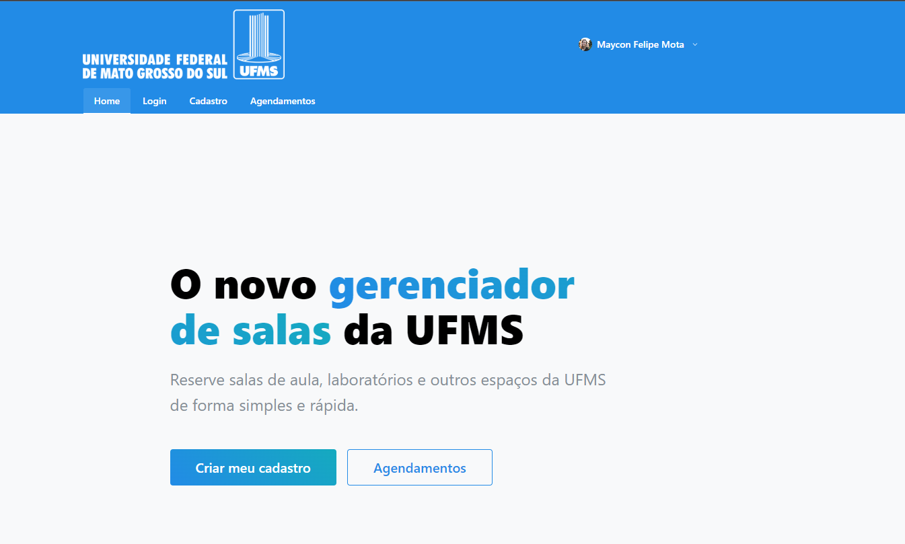

# 🗺 gerenciador_de_sala 

<br></br>
Esse é o repositório do projgerenciador_de_salas, que é um projeto de gerenciamento de salas de uma universidade. 
O projeto foi desenvolvido para ser o trabalho final da disciplina de Programação para Web do curso de Engenharia de Software da Universidade Federal do Mato Grosso do Sul.

# 💻 Tecnologias 
Para o desenvolvimento da aplicação, foram utilizadas as seguintes tecnologias:

## ⚡ Backend
- Python 3.9
- Poetry (gerenciador de dependências)
- FastAPI (Framework para o desenvolvimento da aplicação Backend)
- Docker (Containerização)
- MySQL (Banco de dados)
  

## 🎨 Frontend
Para o desenvolvimento do frontend, foi utilizado o framework ReactJS/NextJS, com as seguintes tecnologias:
- [ReactJS](https://reactjs.org/)
- [NextJS](https://nextjs.org/) 
- [Material UI](https://mui.com/pt/)


## 📖 Como executar o projeto?

Para executar o projeto, é necessário ter o Docker e o Docker Compose instalados.
Após instalar Docker/Docker Compose, faça o clone do repositório e execute o comando abaixo:

```bash
git clone https://github.com/FelipeGaleao/gerenciador_de_salas
cd gerenciador_de_salas
```

Em sequência, será necessário executar as duas aplicações (backend e frontend) em containers separados.

### 🐍 Backend

Siga as instruções do README.md do backend para executar a aplicação Backend. <br>
Clique [aqui](backend/README.md) para acessar o README.md da aplicação Backend.


### 🚀 Aplicação Frontend e Backend
Basta executar o comando na raiz do projeto para executar a aplicação:

```bash
docker-compose up -f ./deploy/docker-compose.yml
```

